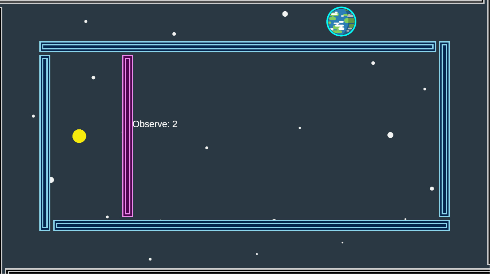
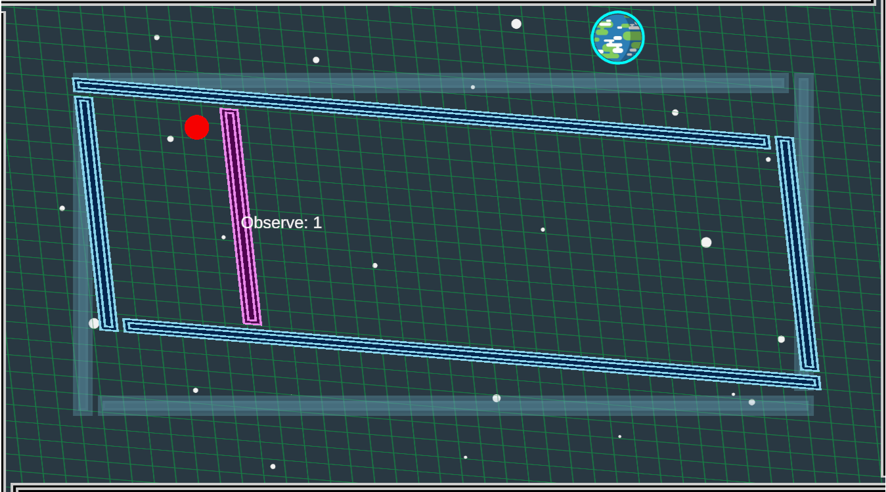

# TORP (Theory of Relativity Puzzle)

## 遊び方

プレイヤー（月）をゴール（地球）まで導けばクリアです。

`Click` Playerを動かします。

`Space` 相対論モードに切り替わります。

`R` ステージをリセットします。

`N` ひとつ後のステージに切り替わります。

`P` ひとつ前のステージに切り替わります。

## 相対論モードについて

プレイヤーは壁に阻まれてゴールまでたどり着けません。

この状況を打破するのが相対論モードです。

`Space` で相対論モードに入ることが出来ます。

相対論モードでは、周囲の壁が相対性理論に従って歪みます。

この歪みを上手く制御して、プレイヤーがゴールへ行く通り道を作ってください！

なお、相対論モードが使える回数には制限があります（画面中央の `Observe: 1` というのが残り回数です）。

## ギミック

`青い壁` 相対論モードによって歪みます。

`黒い壁` 相対論モードであっても歪みません。

`ピンクの壁` 1回目の相対論モードでのみ歪みますが、その後は歪みません。